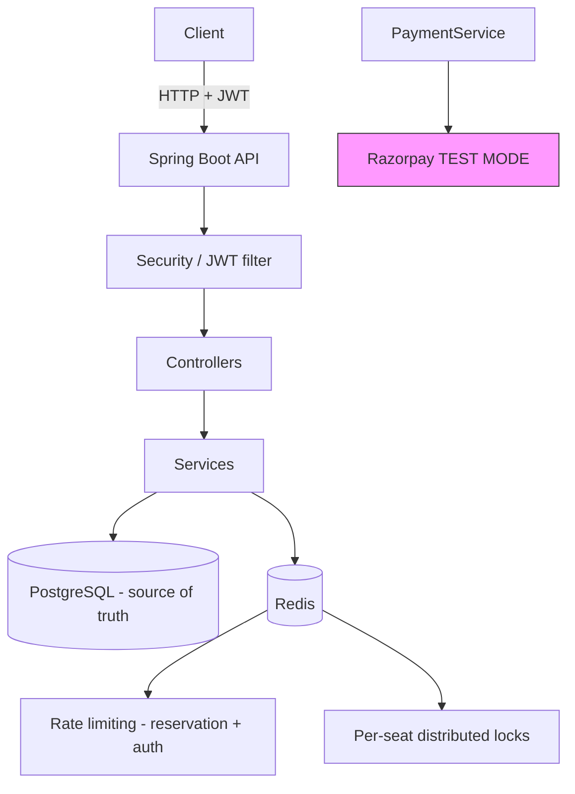

# FlashReserve

A high-throughput **flash-sale and ticket reservation backend** built with Spring Boot. It solves the classic flash-sale problem - many concurrent users racing for a small number of seats - without overselling, using a layered combination of Redis distributed locking, PostgreSQL optimistic locking, and distributed rate limiting.

**Status:** backend feature-complete for the core booking lifecycle, with Razorpay **TEST MODE** payments integrated. The React + Vite frontend foundation was initialized but has no pages yet. There is no production payment processing and no cloud deployment yet (see [Project status](#project-status)).

---

## What FlashReserve does

1. Visitors browse **published events** and their seat maps (public, no login).
2. A registered user **reserves an available seat**, which places it on a short temporary hold (a `PENDING` booking with an expiration time).
3. The user **pays through Razorpay TEST MODE Checkout**; the backend creates the payment order server-side and verifies the provider's signature before confirming.
4. On successful verification the booking becomes `CONFIRMED` and the seat `BOOKED`.
5. If the user never pays, the hold **expires automatically** and the seat returns to `AVAILABLE` for the next buyer.

## Main technical challenges

- **No overselling under contention** - the same seat can be reserved concurrently by hundreds of users during a flash sale.
- **Fair, bounded load** - protecting the reservation hot path and public auth endpoints from request floods and brute force.
- **Safe asynchronous expiration** - background hold expiration must never race with a live payment or cancellation.
- **Trustworthy payments** - a client can never claim a successful payment on its own.

## Technology stack

| Layer | Technology |
|---|---|
| Language / runtime | Java 17 |
| Framework | Spring Boot (Web MVC, Security, Data JPA, Validation, Actuator) |
| Database | PostgreSQL |
| Coordination | Redis (via Redisson) - locking + rate limiting only |
| Authentication | JWT (jjwt), stateless, BCrypt password hashing |
| Payments | Razorpay Java SDK, **TEST MODE only** |
| API documentation | Springdoc OpenAPI 3 + Swagger UI |

## Architecture

```
Controller  ->  Service  ->  Repository  ->  PostgreSQL
```



There are no message queues, WebSockets, or microservices - a deliberate single-service design.

## Core booking lifecycle

Only states that actually exist in the code are listed.

**Seat**

```text
AVAILABLE
   | reserve (POST /api/events/{eventId}/seats/{seatId}/reservations)
   v
HELD
   |-- hold expires          --> AVAILABLE (booking becomes EXPIRED)
   |-- user cancels booking  --> AVAILABLE (booking becomes CANCELLED)
   +-- payment verified      --> BOOKED    (booking becomes CONFIRMED)
```

**Booking**

```text
PENDING
   |-- expiration job (past expiresAt)      --> EXPIRED
   |-- owner cancels                        --> CANCELLED
   +-- payment verified (signature checked) --> CONFIRMED
```

**Payment**

```text
PENDING --> SUCCESS (booking CONFIRMED, seat BOOKED)
        +--> FAILED (client-side checkout failure; hold released consistently)
```

**Event (admin-managed)**

```text
DRAFT --> PUBLISHED --> CANCELLED
```

## Concurrency protection

The design uses several independent safety layers, each with a clear job:

- **Redis distributed seat lock** - a per-seat (`eventId` + `seatId`) lock via Redisson absorbs flash-sale contention *before* it reaches the database. If Redis is unreachable, reservation fails with a controlled `503` rather than proceeding without the lock.
- **PostgreSQL `@Version` optimistic locking on seats** - the final correctness authority. If two transactions race to change the same seat row, exactly one wins; the loser gets a `409` and rolls back both the seat and booking changes together.
- **Transactional reservation** - the seat state change and booking creation happen in one short PostgreSQL transaction *inside* the distributed lock, so the pair can never be left inconsistent.
- **Safe hold expiration** - a scheduled job expires due holds in single-booking transactions. If a seat was concurrently modified, the optimistic lock fails and *both* changes roll back; the job retries on its next pass with fresh state. A seat already `BOOKED` by a completed payment is never released.
- **Duplicate email protection** - a PostgreSQL unique constraint (`uk_users_email`) is the final arbiter for concurrent registrations: the loser surfaces as an expected `409`, never a `500`.
- **Payment / cancellation / expiration race protection** - payment confirmation re-checks booking `PENDING` + seat `HELD` inside the transaction and relies on the seat's optimistic lock, so an expired or cancelled booking can never be confirmed.

## Redis usage

Redis is used for **coordination only** - never as a source of truth:

- **Reservation rate limiting** - one token bucket per user, shared across all app instances.
- **Authentication rate limiting** - one token bucket per client IP, per endpoint (login, registration).
- **Seat locking** - short-lived distributed locks around the reservation transaction.

All seat, booking, and payment state lives exclusively in PostgreSQL.

## Rate limiting

- **Reservations** (per user): `10` requests per `1s` by default - protects the hot path from floods.
- **Login / registration** (per client IP): `20` / `10` requests per `1m` by default - stops brute force and registration spam.

Both are configurable via properties (see below) and return `429 Too Many Requests` with a `Retry-After` header.

## Authentication

- Stateless **JWT Bearer** authentication: `Authorization: Bearer <JWT>`.
- Tokens are issued by `POST /api/auth/register` and `POST /api/auth/login`; passwords are hashed with BCrypt.
- Roles: `USER` (reservations, bookings, payments) and `ADMIN` (event management). There is no self-service way to become an admin.
- Login failures always return a generic `401` that does not reveal whether the email or the password was wrong.
- Every booking is **owner-scoped**: another user's booking is indistinguishable from a missing one (`404` for both).

## Razorpay TEST MODE

Payments use the Razorpay Java SDK in **TEST MODE only** - no real money is involved.

Conceptual configuration (put real values only in your local, git-ignored `application.properties`):

```properties
razorpay.key-id=your_test_key_id
razorpay.key-secret=your_test_key_secret
razorpay.currency=INR
```

Key points:

- Get test keys from the Razorpay Dashboard (Test mode). Keep the **key secret local only** - never commit it.
- The payment **amount always comes from the event's server-side ticket price**; the client never supplies one.
- The backend creates the Razorpay order server-side and exposes only the **public key id** to clients.
- Successful confirmation requires **server-side HMAC signature verification** (`order_id` + `payment_id` + signature) - a client cannot fake a success.
- Payment initiation fails with a controlled error until both key values are configured.

## Configuration (local setup)

`backend/src/main/resources/application.properties` is **git-ignored** and holds your private local values. Copy what you need from `backend/src/main/resources/application-example.properties` (placeholders only):

| What | Property | Notes |
|---|---|---|
| Database URL | `spring.datasource.url` | `jdbc:postgresql://localhost:5432/flashreserve` |
| DB credentials | `spring.datasource.username` / `password` | local only |
| JWT secret | `jwt.secret` | >= 32 chars; e.g. `openssl rand -base64 64` |
| Razorpay keys | `razorpay.key-id` / `razorpay.key-secret` | TEST MODE keys, local only |
| Redis | `spring.data.redis.host` / `port` | default `localhost:6379` |
| Hold duration | `reservation.hold-duration` | default `5m` |
| Rate limits | `reservation.rate-limit.*`, `auth.*.capacity` | see example file |

Secrets can also come from environment variables (`JWT_SECRET`, `REDIS_HOST`, ...) - the example file shows the placeholders.

## Running the backend

Prerequisites: Java 17, PostgreSQL, Redis (Docker makes the last one easy).

```bash
cd backend
./mvnw.cmd spring-boot:run        # Windows
./mvnw spring-boot:run            # Linux/macOS
```

The app starts on `http://localhost:8080`.

## Running the tests

```bash
cd backend
./mvnw.cmd clean test             # Windows
./mvnw clean test                 # Linux/macOS
```

The suite (integration + concurrency + unit) currently contains **133 tests**, all passing. Tests require a reachable PostgreSQL and Redis instance; unit-only tests run without them.

## Running the frontend

The React + Vite client (JavaScript, no TypeScript) lives in `frontend/`. It currently provides only the app foundation; pages are built in later commits.

```bash
cd frontend
npm install
npm run dev            # starts the Vite dev server on http://localhost:5173
```

The backend runs separately on <http://localhost:8080>. The API base URL is configured in `frontend/.env` (copy `frontend/.env.example`; VITE_* values are public and must never contain secrets).

## API documentation

Interactive documentation is served by Springdoc OpenAPI:

- **Swagger UI:** <http://localhost:8080/swagger-ui/index.html>
- **OpenAPI 3 JSON:** <http://localhost:8080/v3/api-docs>
- **Production:** the `production` profile disables both, so `/v3/api-docs` and `/swagger-ui/**` return `404` and the API contract is not publicly discoverable (applied by `ProductionProfileInitializer`; there is no `application-production.properties` file).

Swagger UI includes an **Authorize** button - paste the JWT you get from `/api/auth/login` and it will send `Authorization: Bearer <JWT>` on protected calls. Every endpoint documents its required role, parameters, and the important error responses (`400`, `401`, `403`, `404`, `409`, `429`, `503`) in the project's standard `ApiError` JSON shape.

### Endpoint overview

| Method | Path | Access | Purpose |
|---|---|---|---|
| POST | `/api/auth/register` | Public | Create a USER account, returns JWT (`429` rate limited per IP) |
| POST | `/api/auth/login` | Public | Authenticate, returns JWT (`429` rate limited per IP) |
| GET | `/api/events` | Public | Paginated list of published events (`page`, `size`, `sort`; default size 20, maximum effective size 100 — larger values are clamped) |
| GET | `/api/events/{eventId}` | Public | Published event detail |
| GET | `/api/events/{eventId}/seats` | Public | Seat map, optional `?status=` filter |
| POST | `/api/events/{eventId}/seats/{seatId}/reservations` | USER | Reserve a seat (temporary hold) - `409` if taken, `429` rate limited per user, `503` if Redis is down |
| GET | `/api/bookings` | USER | Caller's own bookings, paginated |
| GET | `/api/bookings/{bookingId}` | USER | One owned booking (`404` for foreign/missing) |
| POST | `/api/bookings/{bookingId}/cancel` | USER | `PENDING`: cancel and release the seat. `CONFIRMED`: full Razorpay refund first, then cancel (rejected after event start / on refund failure) |
| POST | `/api/bookings/{bookingId}/payment` | USER | Create/reuse a Razorpay TEST order for the booking |
| POST | `/api/bookings/{bookingId}/payment/verify` | USER | Verify the checkout result; confirms on valid signature |
| POST | `/api/admin/events` | ADMIN | Create a DRAFT event with its seat inventory |
| PUT | `/api/admin/events/{eventId}` | ADMIN | Update an event |
| PATCH | `/api/admin/events/{eventId}/publish` | ADMIN | Publish the event |
| PATCH | `/api/admin/events/{eventId}/cancel` | ADMIN | Cancel the event |
| GET | `/actuator/health` | Public | Health, liveness and readiness status only |

## Security considerations

- **Public (no JWT):** registration, login, published event browsing, health. **Everything else requires a JWT**; anything not explicitly permitted is denied by default.
- **Swagger UI / OpenAPI JSON are public to browse**, but calling a protected API from Swagger still requires a real JWT.
- No secrets are committed: `application.properties` is git-ignored; only `application-example.properties` (placeholders) is tracked.
- **Production requires the `JWT_SECRET` environment variable.** The `production` profile (`application-production.properties`) has **no fallback**: startup fails when the variable is missing/empty or matches a known placeholder/default value, so the application can never boot with a forgeable, publicly-known signing key. Local development keeps its own strong secret (>= 32 characters) in the git-ignored `application.properties` or via `JWT_SECRET` - never in tracked files.
- The JWT secret and Razorpay key secret are read from the environment or local config only, and never appear in API responses or logs.
- The Razorpay **key secret never leaves the server**; clients only ever see the public key id.
- Actuator exposes **only health endpoints** (`management.endpoints.web.exposure.include=health`); env, beans, mappings and configprops are not exposed.
- Stateless sessions, CSRF disabled (token-based API), generic auth-failure messages, and owner-scoped lookups prevent account/booking enumeration.

## Project status

**Implemented:**

- JWT authentication with USER/ADMIN roles and BCrypt hashing
- Public event browsing + admin event lifecycle with atomic seat inventory creation
- Contention-safe seat reservation (Redis lock + optimistic locking + rate limiting)
- Background hold expiration with race-safe seat release
- Booking listing/detail/cancellation (owner-scoped)
- Razorpay TEST MODE payment initiation and server-side signature verification
- OpenAPI/Swagger documentation and health endpoints
- 133 passing integration, concurrency, and unit tests

**Not implemented (future roadmap):**

- Frontend client
- Real production payment processing (current integration is TEST MODE only; no real-money transactions)
- Webhooks / asynchronous payment reconciliation
- AWS or any cloud deployment
- Kafka or other message queues; WebSockets
- CI/CD pipeline

---

## Deployment (Production)

This repository is prepared for:

- **Backend:** Render Web Service (Docker) — Spring Boot 4.1.x, Java 17
- **Frontend:** Vercel — React + Vite (JavaScript)
- **Database:** Supabase PostgreSQL
- **Redis:** Render Key Value (Redis)
- **Payments:** Razorpay TEST MODE

No deployment is performed from this repository; you configure the accounts and set the environment variables below.

### Architecture

```
Browser (Vercel) ──HTTPS──>  Vercel static (React + Vite)
        │
        │  VITE_API_BASE_URL = https://<render-backend>.onrender.com
        ▼
Render Web Service (Docker) ──jdbc:postgresql + sslmode=require──> Supabase PostgreSQL
        │
        │  redis:// or rediss:// + password
        ▼
Render Key Value (Redis)  ── locks, rate-limit buckets, OTP, SSE RTopic
        │
        └── Razorpay TEST MODE (server-side order create + signature verify + webhook)
```

### Backend — Render Web Service (Docker)

**Source:** `backend/Dockerfile` (multi-stage, Java 17).

- Build: `maven:3.9-eclipse-temurin-17` → `mvn package -DskipTests` (the POM excludes `application.properties` and copies `application-example.properties` as `application.properties`, so no local secrets are baked in).
- Runtime: `eclipse-temurin:17-jre-jammy` (JRE only, minimal, non-root `appuser`).
- Entrypoint: `java -jar /app/app.jar` — respects `server.port=${PORT:8080}` (Render injects `PORT`).
- Health check: `GET /actuator/health` (only `health` is exposed; `management.endpoints.web.exposure.include=health`).
- No `application.properties` or secrets are copied into the image; `.dockerignore` excludes `target/` and `application.properties`.

**Render settings:**

| Setting | Value |
|---|---|
| Runtime | Docker |
| Dockerfile path | `backend/Dockerfile` |
| Build context | `backend/` (or repo root with `backend/Dockerfile` — Render supports either; keep the `COPY pom.xml` / `COPY src` paths consistent) |
| Health check path | `/actuator/health` |
| Port | Render injects `PORT` automatically; app binds via `server.port=${PORT:8080}` |
| Branch | `main` (or your deploy branch) |

**Required environment variables (Render → Environment):**

| Variable | Where | Notes |
|---|---|---|
| `SPRING_PROFILES_ACTIVE` | `production` | Enables `ProductionProfileInitializer`: disables Swagger/OpenAPI and forces `jwt.secret=${JWT_SECRET}` with no fallback |
| `PORT` | Render sets automatically | Do not set manually; app already uses `server.port=${PORT:8080}` |
| `DATABASE_URL` | `jdbc:postgresql://<supabase-host>:5432/postgres?sslmode=require` | Full JDBC URL. Prefer `sslmode=require` for Supabase. See Supabase section. |
| `DB_USERNAME` | Supabase user (e.g. `postgres.<project-ref>`) | From Supabase → Database → Connection string |
| `DB_PASSWORD` | Supabase password | Never commit; set in Render only |
| `JWT_SECRET` | random ≥32 chars, `openssl rand -base64 64` | Required in `production`; no default — startup fails if missing/placeholder |
| `REDIS_HOST` | Render Key Value internal hostname (e.g. `redis-xxxxx`) | Use **internal** host when backend and Redis share the same Render region (no TLS) |
| `REDIS_PORT` | `6379` | Render Key Value port |
| `REDIS_PASSWORD` | Render Key Value password | Set when Redis requires auth; blank for local dev |
| `REDIS_SSL_ENABLED` | `false` (internal) / `true` (external/TLS) | `false` for Render internal URL (`redis://`), `true` for external `rediss://` |
| `CORS_ALLOWED_ORIGINS` | `https://<your-vercel-app>.vercel.app` | Comma-separated allow-list; `*` is never allowed; empty disables CORS (local dev via Vite proxy) |
| `RAZORPAY_KEY_ID` | `rzp_test_…` | TEST MODE key id — public; backend exposes it to frontend via payment-initiation API |
| `RAZORPAY_KEY_SECRET` | `…` | TEST MODE secret — **backend only**, never expose to frontend |
| `RAZORPAY_WEBHOOK_SECRET` | `…` | From Razorpay Dashboard → Webhooks → Secret — backend only |
| `MAIL_USERNAME` | Gmail address for OTP | The OTP sender account |
| `MAIL_PASSWORD` | Gmail App Password (not normal password) | https://myaccount.google.com/apppasswords |
| `JWT_EXPIRATION_MS` | `3600000` (optional) | Override JWT TTL; defaults to 1h |
| `RAZORPAY_CURRENCY` | `INR` (optional) | Override currency; defaults to `INR` |

Optional tuning (all have local defaults): `RESERVATION_HOLD_DURATION`, `RESERVATION_EXPIRATION_INTERVAL`, `RESERVATION_LOCK_WAIT_DURATION`, `RESERVATION_RATE_LIMIT_CAPACITY`, `RESERVATION_RATE_LIMIT_REFILL_PERIOD`, `AUTH_LOGIN_RATE_LIMIT_CAPACITY`, `AUTH_LOGIN_RATE_LIMIT_REFILL_PERIOD`, `AUTH_REGISTRATION_RATE_LIMIT_CAPACITY`, `AUTH_REGISTRATION_RATE_LIMIT_REFILL_PERIOD`.

Flyway: `spring.flyway.enabled=true`, `ddl-auto=validate`, `baseline-on-migrate=true`, `baseline-version=1` — existing `V1` and `V2` migrations are unchanged; no new migration is created for deployment.

### Supabase PostgreSQL — Connection

- In Supabase Dashboard → Database → Connect → `JDBC` (or `Connection string` → `JDBC`): copy the JDBC URL. Ensure `?sslmode=require` is present for production TLS. Example placeholder:
  ```
  jdbc:postgresql://db.<project-ref>.supabase.co:5432/postgres?sslmode=require
  ```
- If Supabase shows a `postgresql://` (non-JDBC) URL, convert the scheme to `jdbc:postgresql://` and keep the same host/user/password/query.
- Set `DATABASE_URL` to that full JDBC URL, plus `DB_USERNAME` / `DB_PASSWORD` separately (the example properties use `${DATABASE_URL}`, `${DB_USERNAME}`, `${DB_PASSWORD}`). Never hardcode the URL, username, or password in the repository.
- The app validates the schema with `ddl-auto=validate` and Flyway; it never modifies DDL via Hibernate.

### Render Key Value (Redis) — Connection

- Create a **Render Key Value** (Redis) in the **same region** as the backend service to use the internal URL (lower latency, no TLS).
- Use the internal hostname/port/password shown in Render → Key Value → Connections → Internal. Set:
  ```
  REDIS_HOST=<internal-hostname>
  REDIS_PORT=6379
  REDIS_PASSWORD=<password-if-required>
  REDIS_SSL_ENABLED=false
  ```
- If connecting externally (different region or from local), use the external URL and set `REDIS_SSL_ENABLED=true` (client uses `rediss://`).
- `RedisConfig.java:21` builds `redis://` or `rediss://` based on `REDIS_SSL_ENABLED` and sets `password` when non-blank. Distributed reservation locks, rate limiting, OTP storage, and SSE `RTopic` pub-sub all use this single `RedissonClient`.

### Frontend — Vercel

**Source:** `frontend/` — Vite + React (JavaScript, no TypeScript).

| Setting | Value |
|---|---|
| Framework preset | Vite |
| Build command | `npm run build` |
| Output directory | `dist` |
| Node version | 18+ (Vercel default) |

**Required environment variable (Vercel → Project → Settings → Environment Variables):**

| Variable | Value | Scope |
|---|---|---|
| `VITE_API_BASE_URL` | `https://<render-backend>.onrender.com` | Production (and Preview if you use preview backends) |

- Leave `VITE_API_BASE_URL` **empty** for local dev — Vite proxies `/api` to `http://localhost:8080` (`frontend/vite.config.js:10`).
- Only `VITE_*` variables are exposed to the browser. Never put `JWT_SECRET`, `DB_*`, `REDIS_*`, `RAZORPAY_KEY_SECRET`, `RAZORPAY_WEBHOOK_SECRET`, `MAIL_*` in the frontend — `frontend/.env.example:1` documents this.
- Only the **public** Razorpay key id (`RAZORPAY_KEY_ID` / `rzp_test_…`) may be exposed to the frontend, and only via the backend's payment-initiation response (`PaymentInitiationResponse.razorpayKeyId`), never as a frontend env secret.
- After Vercel assigns the production URL (e.g. `https://flash-reserve.vercel.app`), set the backend's `CORS_ALLOWED_ORIGINS` to exactly that origin:
  ```
  CORS_ALLOWED_ORIGINS=https://flash-reserve.vercel.app
  ```
  For multiple origins: `https://app.example.com,https://admin.example.com`. Never use `*` when `allowCredentials=true` (`CorsConfig.java:46` filters it out).

### Verification checklist (local, before deploy)

```bash
# Backend — no secrets baked into the JAR
cd backend
mvn package -DskipTests
jar tf target/flashreserve-0.0.1-SNAPSHOT.jar | grep application.properties
unzip -p target/flashreserve-0.0.1-SNAPSHOT.jar BOOT-INF/classes/application.properties | grep -E "server.port|RAZORPAY|MAIL|DATABASE_URL"

# Backend — tests (require local PostgreSQL + Redis)
mvn test                    # full suite; see note on max_connections below
mvn test -Dtest=DatasourcePropertiesTests,RedisConfigTests,CorsIntegrationTests  # fast, no DB needed for these

# Frontend
cd ../frontend
npm run lint
npm run build               # produces dist/

# Docker (requires Docker Desktop; slow on throttled networks — Render builds faster)
docker pull eclipse-temurin:17-jre-jammy
docker pull maven:3.9-eclipse-temurin-17
docker build -f backend/Dockerfile -t flashreserve-backend:test backend

# Git hygiene
git status                  # must show only intended changes
git diff --cached --name-only
grep -r "<db-password-prefix>|<gmail-username>|<razorpay-key-id-prefix>|<mail-app-password-prefix>" backend/src/main/resources/application-example.properties && echo "LEAKED" || echo "clean"
```

**Known local test flake:** `FATAL: sorry, too many clients already` when running the full backend test suite in parallel on a local PostgreSQL with `max_connections=100`. Each `SpringBootTest` context opens a Hikari pool (`maximum-pool-size=5` — `application-example.properties:15`); many contexts in parallel can exceed 100. Mitigations: run a subset (`-Dtest=...`), run sequentially, or raise `max_connections` in `postgresql.conf` (requires restart). Not a production blocker — production uses a single Render instance per deploy with a single pool.

### Secrets hygiene

- `.gitignore:14` ignores `application*.properties` (except `application-example.properties`), `.env`, `.env.*` (except `.env.example`).
- `backend/.gitignore:5` mirrors this.
- `backend/pom.xml:119` excludes `application.properties` from the JAR and `backend/pom.xml:128` copies `application-example.properties` as `application.properties` at build time — so `backend/src/main/resources/application.properties` (which contains local secrets and is git-ignored) can never be baked into `target/*.jar` or the Docker image.
- Actuator exposes only `health` (`application-example.properties:150`).
