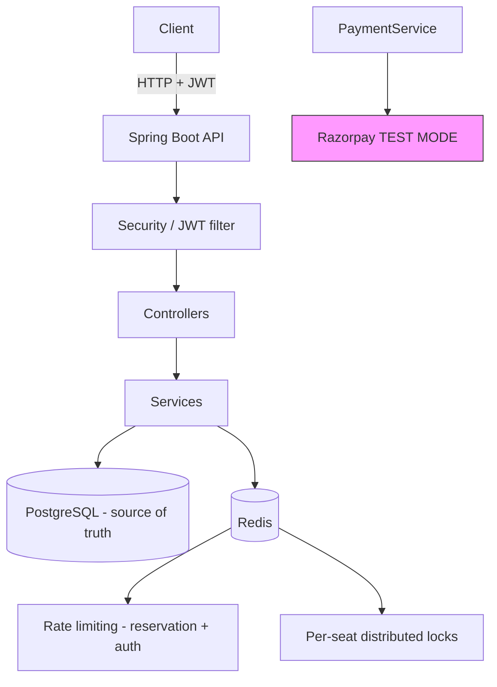

# FlashReserve

A high-throughput **flash-sale and ticket reservation backend** built with Spring Boot. It solves the classic flash-sale problem - many concurrent users racing for a small number of seats - without overselling, using a layered combination of Redis distributed locking, PostgreSQL optimistic locking, and distributed rate limiting.

**Status:** backend feature-complete for the core booking lifecycle, with Razorpay **TEST MODE** payments integrated. The React + Vite frontend foundation was initialized but has no pages yet. There is no production payment processing and no cloud deployment yet (see [Project status](#project-status)).

---

## What FlashReserve does

1. Visitors browse **published events** and their seat maps (public, no login).
2. A registered user **reserves an available seat**, which places it on a short temporary hold (a `PENDING` booking with an expiration time).
3. The user **pays through Razorpay TEST MODE Checkout**; the backend creates the payment order server-side and verifies the provider's signature before confirming.
4. On successful verification the booking becomes `CONFIRMED` and the seat `BOOKED`.
5. If the user never pays, the hold **expires automatically** and the seat returns to `AVAILABLE` for the next buyer.

## Main technical challenges

- **No overselling under contention** - the same seat can be reserved concurrently by hundreds of users during a flash sale.
- **Fair, bounded load** - protecting the reservation hot path and public auth endpoints from request floods and brute force.
- **Safe asynchronous expiration** - background hold expiration must never race with a live payment or cancellation.
- **Trustworthy payments** - a client can never claim a successful payment on its own.

## Technology stack

| Layer | Technology |
|---|---|
| Language / runtime | Java 17 |
| Framework | Spring Boot (Web MVC, Security, Data JPA, Validation, Actuator) |
| Database | PostgreSQL |
| Coordination | Redis (via Redisson) - locking + rate limiting only |
| Authentication | JWT (jjwt), stateless, BCrypt password hashing |
| Payments | Razorpay Java SDK, **TEST MODE only** |
| API documentation | Springdoc OpenAPI 3 + Swagger UI |

## Architecture

```
Controller  ->  Service  ->  Repository  ->  PostgreSQL
```



There are no message queues, WebSockets, or microservices - a deliberate single-service design.

## Core booking lifecycle

Only states that actually exist in the code are listed.

**Seat**

```text
AVAILABLE
   | reserve (POST /api/events/{eventId}/seats/{seatId}/reservations)
   v
HELD
   |-- hold expires          --> AVAILABLE (booking becomes EXPIRED)
   |-- user cancels booking  --> AVAILABLE (booking becomes CANCELLED)
   +-- payment verified      --> BOOKED    (booking becomes CONFIRMED)
```

**Booking**

```text
PENDING
   |-- expiration job (past expiresAt)      --> EXPIRED
   |-- owner cancels                        --> CANCELLED
   +-- payment verified (signature checked) --> CONFIRMED
```

**Payment**

```text
PENDING --> SUCCESS (booking CONFIRMED, seat BOOKED)
        +--> FAILED (client-side checkout failure; hold released consistently)
```

**Event (admin-managed)**

```text
DRAFT --> PUBLISHED --> CANCELLED
```

## Concurrency protection

The design uses several independent safety layers, each with a clear job:

- **Redis distributed seat lock** - a per-seat (`eventId` + `seatId`) lock via Redisson absorbs flash-sale contention *before* it reaches the database. If Redis is unreachable, reservation fails with a controlled `503` rather than proceeding without the lock.
- **PostgreSQL `@Version` optimistic locking on seats** - the final correctness authority. If two transactions race to change the same seat row, exactly one wins; the loser gets a `409` and rolls back both the seat and booking changes together.
- **Transactional reservation** - the seat state change and booking creation happen in one short PostgreSQL transaction *inside* the distributed lock, so the pair can never be left inconsistent.
- **Safe hold expiration** - a scheduled job expires due holds in single-booking transactions. If a seat was concurrently modified, the optimistic lock fails and *both* changes roll back; the job retries on its next pass with fresh state. A seat already `BOOKED` by a completed payment is never released.
- **Duplicate email protection** - a PostgreSQL unique constraint (`uk_users_email`) is the final arbiter for concurrent registrations: the loser surfaces as an expected `409`, never a `500`.
- **Payment / cancellation / expiration race protection** - payment confirmation re-checks booking `PENDING` + seat `HELD` inside the transaction and relies on the seat's optimistic lock, so an expired or cancelled booking can never be confirmed.

## Redis usage

Redis is used for **coordination only** - never as a source of truth:

- **Reservation rate limiting** - one token bucket per user, shared across all app instances.
- **Authentication rate limiting** - one token bucket per client IP, per endpoint (login, registration).
- **Seat locking** - short-lived distributed locks around the reservation transaction.

All seat, booking, and payment state lives exclusively in PostgreSQL.

## Rate limiting

- **Reservations** (per user): `10` requests per `1s` by default - protects the hot path from floods.
- **Login / registration** (per client IP): `20` / `10` requests per `1m` by default - stops brute force and registration spam.

Both are configurable via properties (see below) and return `429 Too Many Requests` with a `Retry-After` header.

## Authentication

- Stateless **JWT Bearer** authentication: `Authorization: Bearer <JWT>`.
- Tokens are issued by `POST /api/auth/register` and `POST /api/auth/login`; passwords are hashed with BCrypt.
- Roles: `USER` (reservations, bookings, payments) and `ADMIN` (event management). There is no self-service way to become an admin.
- Login failures always return a generic `401` that does not reveal whether the email or the password was wrong.
- Every booking is **owner-scoped**: another user's booking is indistinguishable from a missing one (`404` for both).

## Razorpay TEST MODE

Payments use the Razorpay Java SDK in **TEST MODE only** - no real money is involved.

Conceptual configuration (put real values only in your local, git-ignored `application.properties`):

```properties
razorpay.key-id=your_test_key_id
razorpay.key-secret=your_test_key_secret
razorpay.currency=INR
```

Key points:

- Get test keys from the Razorpay Dashboard (Test mode). Keep the **key secret local only** - never commit it.
- The payment **amount always comes from the event's server-side ticket price**; the client never supplies one.
- The backend creates the Razorpay order server-side and exposes only the **public key id** to clients.
- Successful confirmation requires **server-side HMAC signature verification** (`order_id` + `payment_id` + signature) - a client cannot fake a success.
- Payment initiation fails with a controlled error until both key values are configured.

## Configuration (local setup)

`backend/src/main/resources/application.properties` is **git-ignored** and holds your private local values. Copy what you need from `backend/src/main/resources/application-example.properties` (placeholders only):

| What | Property | Notes |
|---|---|---|
| Database URL | `spring.datasource.url` | `jdbc:postgresql://localhost:5432/flashreserve` |
| DB credentials | `spring.datasource.username` / `password` | local only |
| JWT secret | `jwt.secret` | >= 32 chars; e.g. `openssl rand -base64 64` |
| Razorpay keys | `razorpay.key-id` / `razorpay.key-secret` | TEST MODE keys, local only |
| Redis | `spring.data.redis.host` / `port` | default `localhost:6379` |
| Hold duration | `reservation.hold-duration` | default `5m` |
| Rate limits | `reservation.rate-limit.*`, `auth.*.capacity` | see example file |

Secrets can also come from environment variables (`JWT_SECRET`, `REDIS_HOST`, ...) - the example file shows the placeholders.

## Running the backend

Prerequisites: Java 17, PostgreSQL, Redis (Docker makes the last one easy).

```bash
cd backend
./mvnw.cmd spring-boot:run        # Windows
./mvnw spring-boot:run            # Linux/macOS
```

The app starts on `http://localhost:8080`.

## Running the tests

```bash
cd backend
./mvnw.cmd clean test             # Windows
./mvnw clean test                 # Linux/macOS
```

The suite (integration + concurrency + unit) currently contains **133 tests**, all passing. Tests require a reachable PostgreSQL and Redis instance; unit-only tests run without them.

## Running the frontend

The React + Vite client (JavaScript, no TypeScript) lives in `frontend/`. It currently provides only the app foundation; pages are built in later commits.

```bash
cd frontend
npm install
npm run dev            # starts the Vite dev server on http://localhost:5173
```

The backend runs separately on <http://localhost:8080>. The API base URL is configured in `frontend/.env` (copy `frontend/.env.example`; VITE_* values are public and must never contain secrets).

## API documentation

Interactive documentation is served by Springdoc OpenAPI:

- **Swagger UI:** <http://localhost:8080/swagger-ui/index.html>
- **OpenAPI 3 JSON:** <http://localhost:8080/v3/api-docs>

Swagger UI includes an **Authorize** button - paste the JWT you get from `/api/auth/login` and it will send `Authorization: Bearer <JWT>` on protected calls. Every endpoint documents its required role, parameters, and the important error responses (`400`, `401`, `403`, `404`, `409`, `429`, `503`) in the project's standard `ApiError` JSON shape.

### Endpoint overview

| Method | Path | Access | Purpose |
|---|---|---|---|
| POST | `/api/auth/register` | Public | Create a USER account, returns JWT (`429` rate limited per IP) |
| POST | `/api/auth/login` | Public | Authenticate, returns JWT (`429` rate limited per IP) |
| GET | `/api/events` | Public | Paginated list of published events (`page`, `size`, `sort`) |
| GET | `/api/events/{eventId}` | Public | Published event detail |
| GET | `/api/events/{eventId}/seats` | Public | Seat map, optional `?status=` filter |
| POST | `/api/events/{eventId}/seats/{seatId}/reservations` | USER | Reserve a seat (temporary hold) - `409` if taken, `429` rate limited per user, `503` if Redis is down |
| GET | `/api/bookings` | USER | Caller's own bookings, paginated |
| GET | `/api/bookings/{bookingId}` | USER | One owned booking (`404` for foreign/missing) |
| POST | `/api/bookings/{bookingId}/cancel` | USER | `PENDING`: cancel and release the seat. `CONFIRMED`: full Razorpay refund first, then cancel (rejected after event start / on refund failure) |
| POST | `/api/bookings/{bookingId}/payment` | USER | Create/reuse a Razorpay TEST order for the booking |
| POST | `/api/bookings/{bookingId}/payment/verify` | USER | Verify the checkout result; confirms on valid signature |
| POST | `/api/admin/events` | ADMIN | Create a DRAFT event with its seat inventory |
| PUT | `/api/admin/events/{eventId}` | ADMIN | Update an event |
| PATCH | `/api/admin/events/{eventId}/publish` | ADMIN | Publish the event |
| PATCH | `/api/admin/events/{eventId}/cancel` | ADMIN | Cancel the event |
| GET | `/actuator/health` | Public | Health, liveness and readiness status only |

## Security considerations

- **Public (no JWT):** registration, login, published event browsing, health. **Everything else requires a JWT**; anything not explicitly permitted is denied by default.
- **Swagger UI / OpenAPI JSON are public to browse**, but calling a protected API from Swagger still requires a real JWT.
- No secrets are committed: `application.properties` is git-ignored; only `application-example.properties` (placeholders) is tracked.
- The JWT secret and Razorpay key secret are read from the environment or local config only, and never appear in API responses or logs.
- The Razorpay **key secret never leaves the server**; clients only ever see the public key id.
- Actuator exposes **only health endpoints** (`management.endpoints.web.exposure.include=health`); env, beans, mappings and configprops are not exposed.
- Stateless sessions, CSRF disabled (token-based API), generic auth-failure messages, and owner-scoped lookups prevent account/booking enumeration.

## Project status

**Implemented:**

- JWT authentication with USER/ADMIN roles and BCrypt hashing
- Public event browsing + admin event lifecycle with atomic seat inventory creation
- Contention-safe seat reservation (Redis lock + optimistic locking + rate limiting)
- Background hold expiration with race-safe seat release
- Booking listing/detail/cancellation (owner-scoped)
- Razorpay TEST MODE payment initiation and server-side signature verification
- OpenAPI/Swagger documentation and health endpoints
- 133 passing integration, concurrency, and unit tests

**Not implemented (future roadmap):**

- Frontend client
- Real production payment processing (current integration is TEST MODE only; no real-money transactions)
- Webhooks / asynchronous payment reconciliation
- AWS or any cloud deployment
- Kafka or other message queues; WebSockets
- CI/CD pipeline
